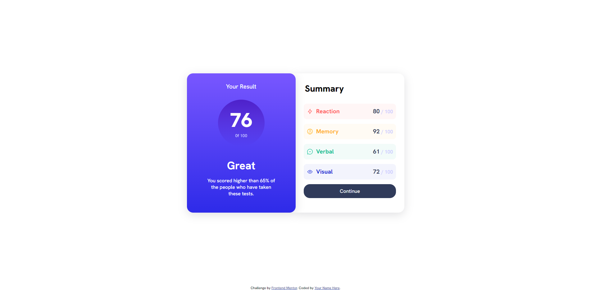
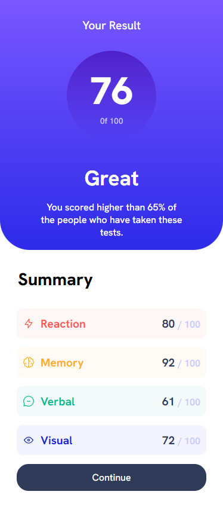

# Frontend Mentor - Results summary component solution

This is a solution to the [Results summary component challenge on Frontend Mentor](https://www.frontendmentor.io/challenges/results-summary-component-CE_K6s0maV). Frontend Mentor challenges help you improve your coding skills by building realistic projects. 

## Table of contents

- [Overview](#overview)
  - [The challenge](#the-challenge)
  - [Screenshot](#screenshot)
  - [Links](#links)
- [My process](#my-process)
  - [Built with](#built-with)
  - [What I learned](#what-i-learned)
  - [Continued development](#continued-development)
- [Author](#author)


## Overview

### The challenge

Users should be able to:

- View the optimal layout for the interface depending on their device's screen size
- See hover and focus states for all interactive elements on the page

### Screenshot





### Links

- Solution URL: [Add solution URL here](https://github.com/EshrakRahman/Results-summary-component-forntendmentor_challenge-)
- Live Site URL: [Add live site URL here](https://eshrakrahman.github.io/Results-summary-component-forntendmentor_challenge-/)

## My process

### Built with

- Semantic HTML5 markup
- CSS custom properties
- Flexbox
- Desktop-first workflow


### What I learned

I recently completed a newbie challenge on FrontendMasters, diving deep into the world of CSS Flexbox. Before this, positioning items in dynamic layouts felt complex. Flexbox, however, transformed my approach, offering a streamlined method to align and distribute elements within a container. Through properties like justify-content, align-items, and flex-direction, I mastered the art of creating responsive and visually appealing designs. This wasn't just about grasping a theoretical concept; it was hands-on learning, giving me the confidence to tackle modern web design challenges with a fresh perspective.

To see how you can add code snippets, see below:

```html
<div class="left-box">
  <div class="contents">
    <p class="rst">Your result</p>
    <div class="circle">
      <p class="fs">76</p>
      <p class="total">0f 100</p>
    </div>

    <p class="great">Great</p>
    <p class="intro">You scored higher than 65% of the people who have taken these tests.</p>
  </div>
</div>
```
```css
@media only screen and (max-width: 375px){
  main {
    display: flex;
    flex-direction: column;
    justify-content: center;
    align-items: center;
  }
  .right-box, .left-box {
    height: 100vh;
    width: 100vw;
    box-shadow: none;
  }

  .left-box {
    border-radius: 0 0 50px 50px;
  }
}
}
```


### Continued development

Having tackled FrontendMasters' challenge, I delved into CSS Flexbox, streamlining complex layouts with newfound mastery. Using pivotal properties, I now confidently craft responsive designs, a testament to my hands-on growth in modern web design. My continuous development highlights my resilience and adaptability.


## Author

- Website - [Eshrak Rahman](https://github.com/EshrakRahman)
- Frontend Mentor - [@eshrakrahman](https://www.frontendmentor.io/profile/EshrakRahman)

